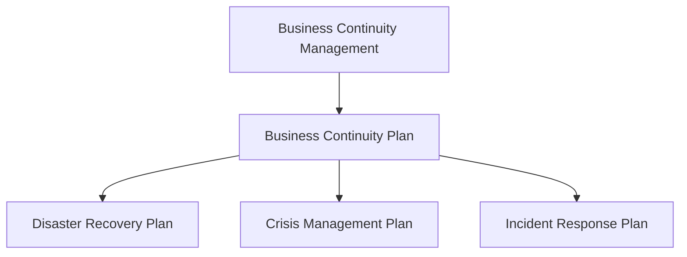

# Business Continuity Management (BCM) 🛠️

In our digital world, businesses rely on IT systems to run smoothly. But what happens when things go wrong? When servers crash or data gets lost, it can disrupt everything. This is where **Business Continuity Management (BCM)** steps in. It's all about making sure that, even in a disaster, a business can keep going.

At the heart of BCM is the **Business Continuity Plan (BCP)**. Think of it like a blueprint for what to do when things go wrong.

## Why BCM is Important 🔍

When things go wrong, you want to have answers to these questions:

- **What are the risks? What might it cost us?**
- **How can we avoid or minimize these risks?**

## Phases of Continuity Planning 🛤️

1. **Risk Identification and Mitigation** 🚧

   - What risks could stop your business?
   - How do you prevent or reduce these risks?

2. **Preparedness** 🎒

   - Make sure you're ready for problems with clear plans, training, and tools.

3. **Response** 🛠️

   - When disaster strikes, follow your plan to handle the situation.

4. **Recovery** 🔄
   - While dealing with the problem, plan how you'll return to normal operations.

## Risk Assessment 🔬

Assess the impact of different incidents on your business.

- **What will this cost us?**
- **How long can we survive without certain systems?**

## Business Impact Analysis (BIA) 📊

BIA answers key questions like:

- **How long can we go without our systems?**
- **How much will a disruption cost us?**

## Evolution of Information 🕰️

The way we manage data has changed over time:

- **1950s: Server-Centric Era**
  - Central servers did all the work.
- **1990s: Network-Centric Era**
  - Computers connected over networks and the internet.
- **21st Century: Information-Centric Era**
  - Data is everywhere. Now, it's all about **securing information** wherever it is.

## Information-Centric Approach 🌐

Today, it's not about where data is, but **how secure it is**. Businesses store and access data across cloud systems, so keeping that information safe is priority number one.

## Data Center Standards 🏢

Data centers hold crucial systems. Standards ensure they run smoothly with minimal downtime. Key areas include:

- **Physical Security**
- **Power and Cooling**
- **Network Infrastructure**

For more on data centers, check out [this resource](https://cc-techgroup.com/data-center-standards).

## High Availability (HA) 🔒

High Availability means keeping systems running with **minimal downtime**. Let's break it down:

1. **Reliability**

   - Design systems to work reliably, preventing frequent failures.
   - **Example:** Use high-quality hardware to prevent breakdowns.

2. **Resiliency**

   - Make sure systems can recover quickly when they do fail.
   - **Example:** Have backup servers take over if one fails.

3. **Availability**

   - Systems should be up and running whenever needed.
   - **Example:** Scale resources during high traffic times to prevent downtime.

4. **Serviceability**
   - Make systems easy to maintain and repair.
   - **Example:** Use modular designs to quickly replace faulty parts.

---

## Security Threats 🛡️

A big part of BCM is dealing with **security threats**. Here are some common ones and how to protect against them:

### Computer Viruses 🦠

- **Viruses** spread by infected files (e.g., opening a corrupted document).
- **Worms** are viruses that spread automatically between computers.
- Use **anti-virus software** to scan and remove viruses.
- Be cautious with **email attachments** and use filtering programs.

### Denial of Service (DoS) Attacks 🚫

- **DoS Attacks** flood a system with so many requests that it can't function.
- **Distributed DoS (DDoS)** attacks come from many computers, making them harder to stop.
- To prevent DoS attacks:
  - Use **traffic filtering** to check where messages come from.
  - Apply **traffic limiting** to manage incoming data.
  - Use **traffic anomaly detectors** to spot unusual activity.

### Intrusion Prevention 🔐

Different intruders mean different risks:

- **Casual Intruders:** Basic knowledge and simple tools.
- **Hackers:** Break in for the challenge or to show off.
- **Crackers:** Cause damage or steal information.
- **Professional Hackers:** Work for espionage or fraud.
- **Insiders:** Employees who misuse access.

**How to prevent intrusions:**

- Test and update security regularly.
- Keep highly sensitive data **offline**.
- Create a **security policy** that includes:
  - Critical assets to protect.
  - Employee roles and responsibilities.
  - Regular security training.

### Disaster Recovery 🌪️

**Disaster Recovery (DR)** ensures you can recover from an incident and keep systems running.

## Building Disaster-Tolerant Systems 🛡️

- **Geographic Diversity**: Spread your data across different locations.
- **Offline Backup**: Store data in a separate location for recovery, but it might take time.
- **Online Backup**: Copy data to a separate site continuously:
  - **Synchronous Replication:** Ensures both sites update before continuing.
  - **Asynchronous Replication:** Updates remotely without waiting.

---

## Learn More 🚀

- **[AWS Well-Architected Framework](https://aws.amazon.com/architecture/well-architected/):** A guide for building secure, resilient, and efficient systems.
