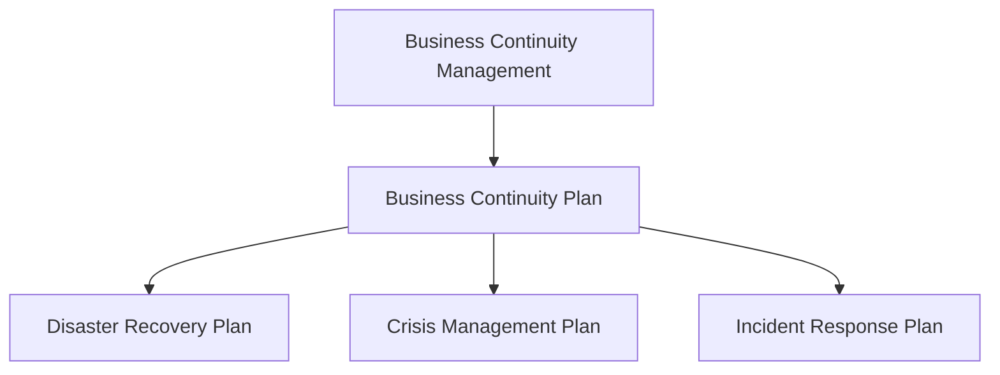

# Business Continuity Management (BCM)

In today's digital age, businesses heavily rely on IT systems and data to operate efficiently. But what happens if these systems fail? The impact could be disastrous, leading to severe disruptions or even halting business operations entirely. To mitigate such risks, it’s crucial to have a plan in place. This is where **Business Continuity Management (BCM)** comes in.

BCM is the framework that ensures a business can continue to operate during and after a disaster while also prioritizing the protection of human lives. The cornerstone of BCM is the **Business Continuity Plan (BCP)**, which outlines the strategies and actions to take during a crisis.

## Key Elements of BCM

BCM is centered on two fundamental questions:

- **What are the risks, and what costs are associated with them?**
- **How can we avoid or minimize the damage from these risks?**

### Phases of Continuity Planning

Effective BCM follows a structured approach, broken down into four key phases:

1. **Risk Identification and Mitigation:**

   - Identify potential risks that could disrupt business operations.
   - Implement measures to avoid or reduce the impact of these risks.

2. **Preparedness:**

   - Ensure that the business is prepared to respond to incidents by creating detailed plans, conducting training sessions, and equipping teams with the necessary tools.

3. **Response:**

   - When an incident occurs, execute the pre-established plan to manage and contain the situation.

4. **Recovery Planning:**
   - Begin planning for recovery even while the incident is still ongoing, ensuring a smooth transition back to normal operations.

### Risk Assessment

An essential component of BCM is assessing the potential impact of different incidents on the business. This involves:

- Evaluating how each incident might affect operations.
- Determining the costs associated with each risk, including both immediate and long-term impacts.

### Business Impact Analysis (BIA)

In the context of BCM, BIA is crucial. It helps answer vital questions like:

- **How long can the business survive without a specific system?**
- **What is the financial cost of such a disruption?**

### Evolution of the Information Era

The way businesses manage and access information has evolved significantly over the decades:

- **1950s: Server-Centric Era**
  - Central servers performed all the work, with terminals connected to them for input and output.
- **1990s: Network-Centric Era**
  - Personal computers (PCs) and servers became connected to the internet, enabling data sharing across networks.
- **21st Century: Information-Centric Era (We Are Here)**
  - Today, information is accessible across all devices, and the focus has shifted to securing information wherever it is stored or accessed.

### Information-Centric Approach

In the information-centric era, the primary focus is on protecting the data itself, regardless of where it is stored or how it is accessed. This shift is crucial as businesses increasingly rely on distributed systems and cloud computing.

### Data Center Standards

Data centers are the backbone of modern IT infrastructure. They house the critical systems and data that businesses rely on daily. Standards for data centers ensure they operate efficiently, securely, and with minimal downtime. These standards cover various aspects, including physical security, power management, cooling, and network infrastructure.

For more in-depth information on data center standards, consider reading [this detailed resource](https://cc-techgroup.com/data-center-standards).

### High Availability (HA)

High Availability (HA) is about ensuring that systems remain operational with minimal downtime. Implementing HA involves four critical aspects:

1. **Reliability:**

   - **Design:** Build the system to work as expected, minimizing the chances of frequent failures.
   - **Example:** Using high-quality components and redundant systems to prevent breakdowns.

2. **Resiliency:**

   - **Design:** Create a system that can quickly detect and recover from failures.
   - **Example:** Implementing failover mechanisms where if one server fails, another takes over without interrupting service.

3. **Availability:**

   - **Design:** Ensure that systems are accessible whenever needed, with strategies like load balancing and auto-scaling.
   - **Example:** A website that automatically scales up resources during peak traffic times to maintain uptime.

4. **Serviceability:**
   - **Design:** Make the system easy to maintain and repair, with clear documentation and monitoring tools.
   - **Example:** Using modular designs that allow for quick replacement of faulty components without affecting the whole system.

---

## Security Threats

As part of BCM, addressing security threats is essential for protecting your IT systems and data. Here’s a look at common threats and how to prevent them:

### Preventing Computer Viruses

- **Viruses** spread when infected files are accessed. Macro viruses, for example, attach themselves to documents and spread when these documents are opened.
- **Worms** are a type of virus that spread automatically from one computer to another without human intervention.
- **Anti-virus software** helps by scanning files and disks to detect and remove viruses.
- **E-mail** is a common source of viruses. Always check attachments and use filtering programs to clean incoming e-mail.

### Preventing Denial of Service (DoS) Attacks

- **DoS Attacks** flood a network with excessive messages, preventing normal users from accessing services.
- **Distributed DoS (DDoS)** attacks come from multiple computers and are harder to prevent. They involve a network of compromised machines sending messages to overwhelm a target.
- **Preventive Measures:**
  - Use **traffic filtering** to verify the source of incoming messages.
  - Implement **traffic limiting** to manage high volumes of incoming packets.
  - Employ **traffic anomaly detectors** to identify and block abnormal patterns.

### Intrusion Prevention

Different types of intruders pose various threats:

- **Casual Intruders:** Have limited knowledge and use basic tools.
- **Security Experts (Hackers):** Seek challenges or to demonstrate their skills.
- **Crackers:** Cause damage and break into systems with malicious intent.
- **Professional Hackers:** Engage in espionage or fraud for specific purposes.
- **Insiders:** Employees who misuse their access to information.

**Preventing Intrusion** involves:

- Routinely testing and updating security systems.
- Keeping extremely sensitive data offline, isolated from the network.
- Developing a **security policy** that outlines:
  - Critical assets and necessary controls.
  - Employee responsibilities.
  - Regular training and security tests.

### Disaster Recovery

**High Availability (HA)** and **Disaster Recovery (DR)** ensure systems can recover and continue functioning after a disaster.

### Designing a Disaster-Tolerant Architecture

- **Geographic Diversity:** Protect data and systems by spreading them across different locations.
- **Off-line Data Replication:** Store backup data at a separate site, but recovery might take time.
- **Online Data Replication:** Continuously copy data to a separate site, with two techniques:
  - **Synchronous Replication:** Ensures all data copies are updated before proceeding.
  - **Asynchronous Replication:** Updates remote data without waiting for the primary site.

---

### Recommended Learning Resources

- **[AWS Well-Architected Framework](https://aws.amazon.com/architecture/well-architected/):** Offers best practices for building secure, high-performing, resilient, and efficient infrastructure for applications.
