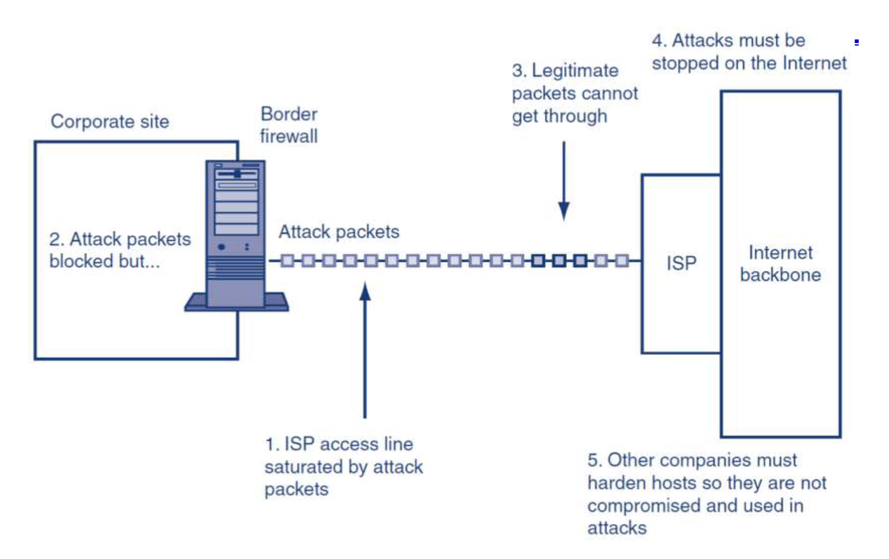
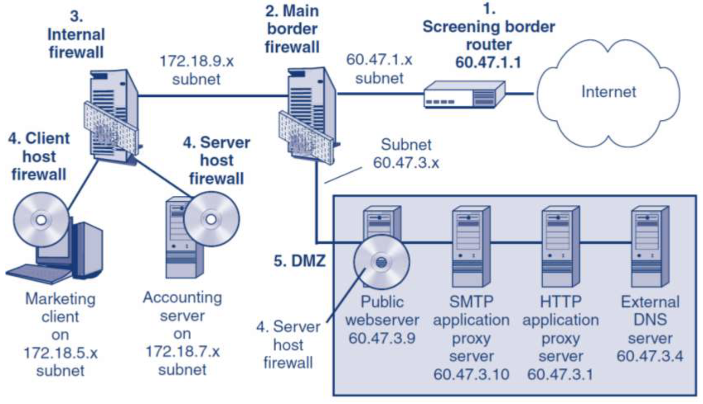
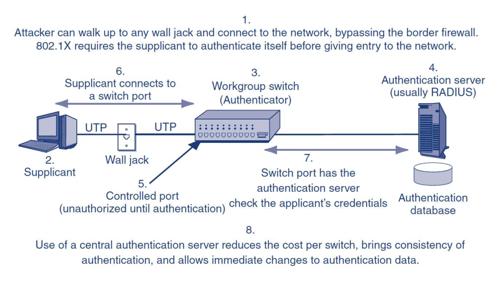
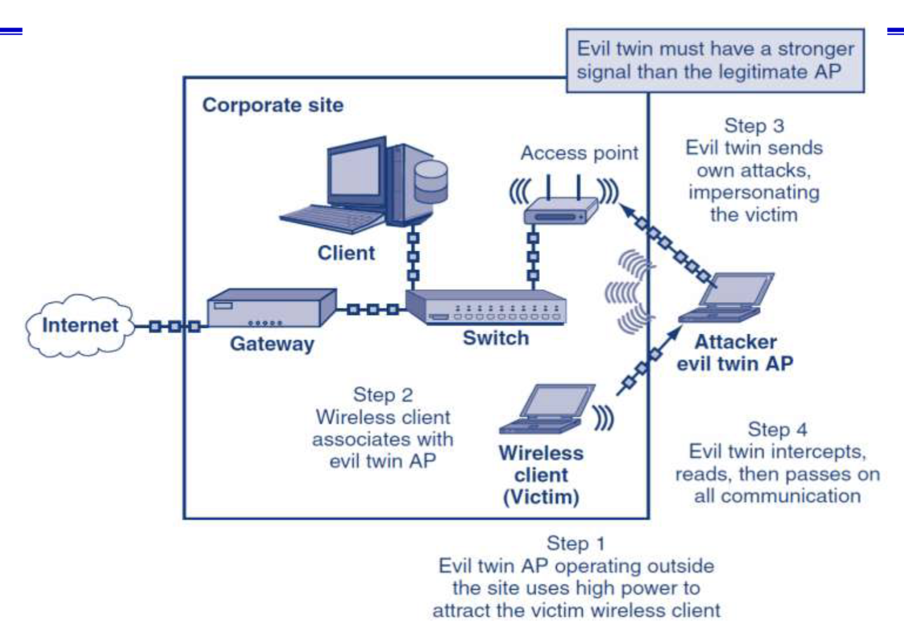

# Secure Networks 🌐🔒

In today's world, creating secure networks is more than just about protecting data—it's about ensuring that our systems work reliably, our communications stay private, and unauthorized users can’t mess things up. As IT students and budding software engineers, understanding network security gives us the power to prevent attacks and protect the digital world we live in. So let's dive in! 🚀

---

## Threats to Secure Networks 🛡️

Secure networks face many threats that can compromise their confidentiality, availability, and functionality.

🔑 **Cryptography**: Ensures that information remains confidential, authentic, and unaltered. Think of it as a lock that only the intended recipient has the key to.

🛠️ **Modern Network Vulnerabilities**:

- **Message delivery issues**: Messages could be stopped, slowed down, or redirected.
- **Route manipulation**: Attackers could change the path your messages take.
- **Fake recipients**: Messages could end up in the wrong hands.
- **Access to private channels**: Attackers might tap into once-secure communication lines.

**Takeaway**: The battle isn't just about making sure people can’t steal our information—it’s also about making sure everything works as expected.

---

## Creating Secure Networks 🌍🔐

The main goals of creating a secure network revolve around four principles:

1. **Availability**: Ensure that users can access information and services when needed.
2. **Confidentiality**: Protect the network from unauthorized users.
3. **Functionality**: Stop attackers from messing with how things work.
4. **Access Control**: Keep unauthorized people out of sensitive areas.

This is like keeping a building secure—make sure the doors are locked, only give keys to the right people, and have a way to track who enters and leaves.

---

## Denial of Service (DoS) Attacks ⚠️

Imagine you’re in line for your favorite coffee, but someone decides to buy all the cups at once, preventing you from getting your drink. That's essentially a **DoS attack**.

### What is a DoS Attack?

- **DoS Attack**: An attack that floods a server or network with so many requests that legitimate users can't access it.

### Not a DoS Attack

- A crash caused by bad coding (though it still makes things unavailable, it’s unintentional).

### Goals of DoS Attacks

- **Harm**: This could mean financial losses, a damaged reputation, or even a loss of trust.

### Methods of DoS Attacks

- **Direct**: Attacker floods the target directly.
- **Indirect**: Attacker hides behind a spoofed IP address.

---

## Stopping DoS Attacks 🛑

Think of DoS attacks as a flood, and your goal is to prevent the water from overwhelming the dam.

🛠️ **Techniques to Defend**:

- **Black holing**: Block packets from suspicious sources (but attackers can change their source).
- **Handshake validation**: Make sure the sender is legit before passing the data along.
- **Rate limiting**: Control how many requests can be made within a certain period to avoid overload.

---

## Firewall Architecture 🔥

Imagine a fortress with multiple gates, walls, and guards protecting a city. That's what a firewall does for your network—it keeps the bad guys out and protects valuable resources inside.

### DMZ (Demilitarized Zone)

A DMZ (Demilitarized Zone) is a network that sits between an internal network and the internet. It allows external users to access specific services while keeping the internal network secure.

**Key points:**

- Protects the internal network from direct exposure to the internet.
- Allows access to public-facing services, like web servers.
- Controlled by firewall rules that regulate traffic flow.
- Provides an extra layer of isolation and security.
- Part of a multi-layered security approach known as defense-in-depth.
- Commonly used for network segmentation and enforcing security policies.

---

## Ethernet and 802.1X 🌐

Ever tried plugging your laptop into a network port at school or work? Without proper security, anyone could connect to your network and cause harm.

Enter **802.1X**, a protocol that ensures users must authenticate before gaining network access.

- **Supplicant**: The device trying to access the network.
- **Authenticator**: The device (like a switch) that decides whether to allow access.
- **Authentication Server**: Verifies whether the user or device should be allowed in.

This setup ensures that even if someone physically connects to a network port, they can’t do much without proper authentication.

---

## Wireless Network Security 🛡️📶

Wi-Fi is great, but it opens up new risks, too. Wireless networks can be targeted in several ways:

- **Unauthorized Network Access**: Open networks (like those in cafés) can be accessed by anyone. Secured networks use encryption and user authentication.
- **Evil Twin Access Points**: This is when a fake wireless access point with a stronger signal tricks users into connecting. Once connected, the fake access point can intercept all communication. Think of it as a stranger offering free Wi-Fi, but at the cost of snooping on everything you do online.

---

## VPN Protection Against Evil Twin APs 🛡️🌐

**Virtual Private Networks (VPNs)** provide an extra layer of security. By encrypting the communication between your device and the network, even if an attacker tries to intercept your data, they won’t be able to read it.

VPNs essentially create a secure "tunnel" between your device and the destination, making it harder for hackers to intercept.

---

## Wireless Network Security Protocols 🛡️📡

There are several types of wireless network security protocols, each with varying levels of protection. Here’s a quick rundown of the most important ones:

1. **WEP (Wired Equivalent Privacy)**: Old and insecure, it was quickly replaced due to vulnerabilities.
2. **WPA (Wi-Fi Protected Access)**: Improved security but still had flaws.
3. **WPA2**: The most commonly used standard today, offering robust encryption (AES).
4. **WPA3**: The newest protocol, offering stronger encryption and security enhancements for modern threats.

---

## Conclusion 🏁

By understanding the basics of secure networks, you’re not only protecting data but ensuring that systems run smoothly and are available when needed. Here are the main takeaways:

1. **Goals**: Availability, confidentiality, functionality, and access control.
2. **DoS Attacks**: These can disrupt services, but they can be defended against with the right techniques.
3. **802.1X**: Helps control who gets access to wired and wireless networks.
4. **Wireless Security Protocols**: Make sure your network is protected by using modern protocols like WPA2 or WPA3.

Secure networks are like well-guarded cities, with firewalls, protocols, and defenses working together to keep intruders out. 🎯

---

## Additional Resources 📚

Want to dive deeper into securing networks? Check out these resources:

- [CISA - Securing Wireless Networks](https://www.cisa.gov/news-events/news/securing-wireless-networks)
- [Cisco - What is a Firewall?](https://www.cisco.com/site/us/en/learn/topics/security/what-is-a-firewall.html)
